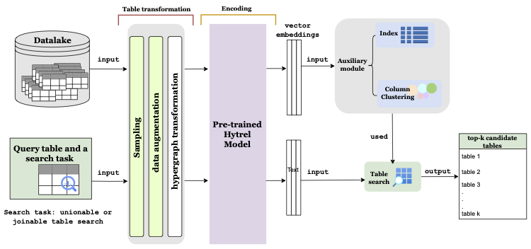

# Extending hypergraph-enhance TaLM for data discovry tasks 
This software is the result of the final year Master's internship/project conducted By Alaa Almutawa at the LIP6 Database research team and funded by Sorbonne Université.. 

## Modules 
|Module| Usage| 
|-------|------|
|[Embedding Computation](embedding_computation/)|Compute embeddings of the data lake columns|
|[Column Clustering](clustering/y)|Preform column clustering on the data lake column vector embeddings|
|[Search](search/)|Execute top-k table search algorithm|
|[Post processing](post_processing/)|Preform post-processing step: LSHEnsemble Filtering and Rerank based on MinHash column values overlap estimation|

## Replication of evaluation results 

To replicate the evaluation results, you can follow the instructions provided in the experiment.md of each module.  

### Benchmarks used 
The dictionaries of the groundtruth for each benchmark used can be found in [here](benchmarks/). The evaluation script prepared expects the groundtruth file to be in the format found here.  
Citation of each benchmark is provided in README.md of the folder dedicated to the benchmark on this repository. 
|Benchmark| Type| Groundtruth| K|
|-------|------|------|------|
|SANTOS|Union|[dictionary](benchmarks/union/santos/santosUnionBenchmark.pickle)|10|
|TUS small|Union|[dictionary](benchmarks/union/TUS/small/sampled/tusLabeledtusUnionBenchmark)|60|
|TUS large|Union|[dictionary](benchmarks/union/TUS/large/sampled/tusLabeledtusLargeUnionBenchmark)|60|
|Pylon|Union|[dictionary](benchmarks/union/pylon/all_ground_truth_sans_recall.pkl)|10|
|testbedS|Join|[set1](benchmarks/join/nextiajd/testbedS/set1/join_dict_testbedS_set1.pkl),[set2](benchmarks/join/nextiajd/testbedS/set2/join_dict_testbedS_set2.pkl),[set3](benchmarks/join/nextiajd/testbedS/set3/join_dict_testbedS_set3.pkl)|10|
|testbedM |Join|[dictionary](benchmarks/join/nextiajd/testbedM/join_dict_testbedM_warpgate.pkl)|10|
|Webtable var1|Join|[dictionary](benchmarks/join/lakebench/webtables/small/join_dict_webtable_small.pkl)|20|
|Webtable var2|Join|[dictionary](benchmarks/join/lakebench/webtables/small_var2/join_dict_webtables_small_var2.pkl)|20|
|Webtable|Join|[dictionary](benchmarks/join/lakebench/webtables/join_dict_final.pkl)|20|
### Experiment configurations 
|Module| Experiment configurations|
|-------|------|
|[Embedding Computation](embedding_computation/)|[link](embedding_computation/experiments.md)|
|[Column Clustering](clustering/)|[link](clustering/experiments.md)|
|[Search](search/)|[link](search/experiments.md)|
|[Post processing](post_processing/)|[link](post_processing/experiments.md)|

### Metrics 
Once a top-k tables have been retrieved from executing the desired search (joinable or unionable table search). You can execute the evaluation script found [here](search/).

## Demo 
Demo of the pipeline can be found [here](demo.ipynb) in a jupyter notebook format. 

